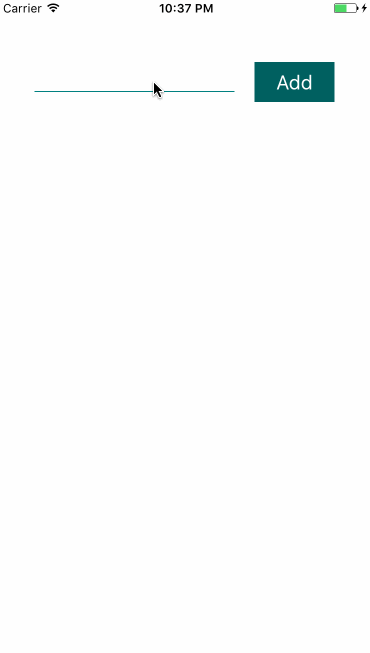

# アプリやるよ〜〜！！

React Nativeの基本を理解することを目的とします！

## クイックインストール
スマートフォンでアプリをインストールしてください

[Android](https://play.google.com/store/apps/details?id=host.exp.exponent&referrer=www)
[iOS](https://itunes.apple.com/app/apple-store/id982107779?ct=www&mt=8)

手取り早くやるためにこっちを使います。
[expo](https://expo.io/)
try Expo Snackを押して出て来た先ほどのアプリで読み込ませます。


## エミュレーター使いたい人向け
メンターはプロなので遠慮なく聞いてください！

```
npm install -g create-react-native-app
create-react-native-app Native

cd Native
npm start
```

```
brew install watchman
npm install -g react-native-cli

react-native init Native

cd Native
react-native run-ios
```


## 概要

- Reactを用いてiOSやAndroidのネイティブアプリを構築できるフレームワーク
- JavaScriptからネイティブのAPIが呼ばれる
- 一度覚えればどのプラットフォーム向けにも書けるようになる
※ 一度書けばどのプラットフォームでも動くわけではない

### メリット

- ネイティブアプリがJavaScriptで書ける
- アプリを素早くビルドできる
- CSSのサブセットがあるため、CSSでスタイリングできる

### デメリット
- 複雑なUIになると、ネイティブコードを書く必要がある

## 基本文法

Reactと同じ！
一点だけ覚えるとしたら、div, spanとかwebのdomを構成するタグは使えません。
かわりに、react-nativeからコンポーンネントを読み込んで使います。

```js
import { Text, View, StyleSheet } from 'react-native';
```

もう一点！
CSSは使えません。代わりにCSS in JS式のスタイリングができます。

```js
const styles = StyleSheet.create({
  container: {
    flex: 1,
    alignItems: 'center',
    justifyContent: 'center',
    paddingTop: Constants.statusBarHeight,
    backgroundColor: '#ecf0f1',
  },
  paragraph: {
    margin: 24,
    fontSize: 18,
    fontWeight: 'bold',
    textAlign: 'center',
    color: '#34495e',
  },
});
```

適用方法
```js
<View style={styles.container}>
```

## 基本コンポーネント

### View
この中に文字を入れることはできません。
基本的に入れ物になります。

### Text
文字を入れるためのコンポーネントになります。

### StyleSheet
スタイルシートを扱うためのものです。
詳しくはこちら[【React-Native】StyleSheetについて](http://qiita.com/YutamaKotaro/items/d0cd253c998f9b28dd55)
(いいねほしい・・・)

## 文法解説（おさらい）
こちらのコードを元に基本を解説して行きます。

```js
import React, { Component } from 'react';
import {
  StyleSheet,
  Text,
  View
} from 'react-native';

export default class App extends Component {
  render() {
    return (
      <View style={styles.container}>
        <Text style={styles.paragraph}>
          Change code in the editor and watch it change on your phone!
          Save to get a shareable url. You get a new url each time you save.
        </Text>
      </View>
    );
  }
}

const styles = StyleSheet.create({
  container: {
    flex: 1,
    alignItems: 'center',
    justifyContent: 'center',
    paddingTop: 64,
    backgroundColor: '#ecf0f1',
  },
  paragraph: {
    margin: 24,
    fontSize: 18,
    fontWeight: 'bold',
    textAlign: 'center',
    color: '#34495e',
  },
});
```

### コンポーネントの読み込み

```js
import {
  StyleSheet,
  Text,
  View
} from 'react-native';
```

## styleの定義
styleSheet.createを使います。
基本はCSSと同じ。flexについては後述します。

```js
const styles = StyleSheet.create({
  container: {
    flex: 1,
    alignItems: 'center',
    justifyContent: 'center',
    paddingTop: 64,
    backgroundColor: '#ecf0f1',
  },
  paragraph: {
    margin: 24,
    fontSize: 18,
    fontWeight: 'bold',
    textAlign: 'center',
    color: '#34495e',
  },
});
```


### コンポーネントの定義
基本はReactと同じ。
CSS in JSと同じスタイルの適用方法。
Textの中に文字を入れる。Viewの中に入れない。

```js
export default class App extends Component {
  render() {
    return (
      <View style={styles.container}>
        <Text style={styles.paragraph}>
          Change code in the editor and watch it change on your phone!
          Save to get a shareable url. You get a new url each time you save.
        </Text>
      </View>
    );
  }
}
```

##　flex
若干のくせのあるスタイリング方法です。
描きコードがわかりやすいと思うのでお試しください。

```js
import React, { Component } from 'react';
import {
  AppRegistry,
  StyleSheet,
  Text,
  View
} from 'react-native';

export default class App extends Component {
  render() {
    return (
      <View style={styles.container}>

        <View style={[styles.base, styles.box1]}>
          <Text style={styles.text}>I am 2.</Text>
        </View>

        <View style={[styles.base, styles.box2]}>
          <Text style={styles.text}>I am 5.</Text>
        </View>

        <View style={[styles.base, styles.box3]}>
          <Text style={styles.text}>I am 1.</Text>
        </View>

      </View>
    );
  }
}

const styles = StyleSheet.create({
  container: {
    flex: 1,
  },
  text: {
    fontSize: 24,
    color: 'white',
  },
  base: {
    justifyContent: 'center',
    alignItems: 'center',
  },
  box1: {
    flex: 2,
    backgroundColor: 'black'
  },
  box2: {
    flex: 5,
    backgroundColor: 'red',
  },
  box3: {
    flex: 1,
    backgroundColor: 'yellow',
  },
});
```

flexは比率になります。
デフォルトでは縦方向の比率になります。
container は１なので画面全部。
containerの中身は2:5:2の比率になります。
<br>
flexの方向を切り替えたい場合は、
flexDirectionにて制御します。

この場合は、

```js
const styles = StyleSheet.create({
  container: {
    flex: 1,
    flexDirection: 'row',
  },
...
```
とすると横方向に2:5:1の比率になります。
詳しくは[こちら](http://qiita.com/YutamaKotaro/items/b6e37c0314a258debaf3)

justifyContent, alignItems はCSSのflexレイアウトと同じです。


## TextInput
続いてはTextInputを扱います。
ここからは普通の説明に加えてアプリケーションっぽいものを作って行きます。


```js
import React, { Component } from 'react';
import {
  StyleSheet,
  Text,
  View,
  TextInput,
} from 'react-native';

export default class App extends Component {
  constructor(props) {
    super(props);

    this.state = {
      text: '',
    }
  }

  _onChangeText = (text) => {
    this.setState({ text });
  }

  render() {
    const {
      text,
    } = this.state;

    return (
      <View style={styles.container}>
        <TextInput
          style={styles.input}
          onChangeText={this._onChangeText}
          underlineColorAndroid="transparent"
        />
        <Text>{text}</Text>
      </View>
    );
  }
}

const styles = StyleSheet.create({
  container: {
    flex: 1,
    alignItems: 'center',
    justifyContent: 'center',
  },
  input: {
    height: 30,
    width: 200,
    borderBottomWidth: 1,
    borderBottomColor: '#008080',
  }
});
```


### TextInputの使い方
```js
    <TextInput
      style={styles.input}
      onChangeText={this._onChangeText}
      underlineColorAndroid="transparent"
    />
```

onChangeTextというイベントハンドラをつけます。
すると入力した文字を受け取れますので、こちらを使ってstateを更新して行きます。
underlineColorAndroidはAndroid対策でついてます(勝手にラインが付いてしまうため)。


### TouchableOpacity & FlatList
さっきのやつを拡張します。


```js
import React, { Component } from 'react';
import {
  StyleSheet,
  Text,
  View,
  TextInput,
  TouchableOpacity,
  FlatList,
} from 'react-native';

export default class App extends Component {
  constructor(props) {
    super(props);

    this.state = {
      text: '',
      list: [],
    }
  }

  _onChangeText = (text) => {
    this.setState({ text });
  }

  _onPress = () => {
    const {
      list,
      text,
    } = this.state;
    const _list = list.concat();
    _list.push({ key:text });

    this.setState({
      text: '',
      list: _list,
    });
  }

  render() {
    const {
      list,
      text,
    } = this.state;

    return (
      <View style={styles.container}>
        <View style={styles.inputArea}>
          <TextInput
            style={styles.input}
            onChangeText={this._onChangeText}
            underlineColorAndroid="transparent"
            value={text}
          />
          <TouchableOpacity
            style={styles.button}
            onPress={this._onPress}
          >
            <Text style={styles.buttonText} >Add</Text>
          </TouchableOpacity>
        </View>
        <FlatList
          data={list}
          renderItem={({item}) => <Text style={styles.itemText}>{item.key}</Text>}
          style={styles.list}
        />
      </View>
    );
  }
}

const styles = StyleSheet.create({
  container: {
    flex: 1,
    alignItems: 'center',
    justifyContent: 'center',
  },
  inputArea: {
    flexDirection: 'row',
    marginTop: 64,
  },
  input: {
    height: 30,
    width: 200,
    borderBottomWidth: 1,
    borderBottomColor: '#008080',
    marginRight: 20,
  },
  button: {
    width: 80,
    height: 40,
    backgroundColor: '#006060',
    justifyContent: 'center',
    alignItems: 'center',
  },
  buttonText: {
    color: 'white',
    fontSize: 20,
  },
  list: {
    width: 300,
  },
  itemText: {
    fontSize: 22,
    margin: 10,
  }
});
```

### ボタンの実装

ボタンを実装するためには今回はTouchableOpacityを使います。
TouchableHightLightやButtonなどを使うこともできます。

```js
  <TouchableOpacity
    style={styles.button}
    onPress={this._onPress}
  >
    <Text style={styles.buttonText} >Add</Text>
  </TouchableOpacity>
```

イベントハンドラはonPressで実装します。
TouchableOpacityは押下した時に透過度が変わりふわっとした印象を与えることができます。

## listの作成

今回はFlatViewを使うことで実装します。
ListViewや自前のコンポーネントを使って実装することもできます。
FlatListは非常に簡単にリストを作成し、スクロールも実装できるコンポーネントです。

```js
    <FlatList
      data={list}
      renderItem={({item}) => <Text style={styles.itemText}>{item.key}</Text>}
      style={styles.list}
    />
```

dataにはstateを与えます。
この時keyを持つオブジェクトの配列として渡す必要があるので

```js
  _onPress = () => {
    const {
      list,
      text,
    } = this.state;
    const _list = list.concat();
    _list.push({ key:text });

    this.setState({
      text: '',
      list: _list,
    });
  }
```

このようにします。
本来的にはkeyには一意のkeyを渡さないといけないのでtextにするのは好ましくありませんが簡略化のためにこうしました。

renderItem関数を渡します。
itemは各要素が渡る事になるので、item.keyにしてkeyを表示させることで登録したものを表示させました。

関数を渡すので、

```js
const List = props => (
  <Text style={styles.itemText}>
    {props.item.key}
  </Text>
)


...

        <FlatList
          data={list}
          renderItem={List}
          style={styles.list}
        />
```

このようにSFCで実装することも可能です。
classFunctionでは実装不可です。

## 課題

todoアプリに内容を変えてみましょう。
仕様としてはタップしたら追加したアイテムが完了状態になればOKです！



### hint

みたい人だけ・・！！
<br>
<br>
<br>
<br>
<br>
<br>
<br>
<br>


#### 打ち消し線のやり方

```js
<Text style={styles.lineThrough}>text</Text>

...

const styles = StyleSheet.create({
  lineThrough: {
    textDecorationLine: 'line-through',
  }
})
```

TextコンポーネントにtextDecorationLine: 'line-through'を与えることで打ち消し線を実現できます。

#### 押されたやつだけdoneを変更するロジック

```js
  _onPressItem = (index) => () => {
    const {
      list,
    } = this.state;
    const _list = list.concat();

    _list[index].done = !_list[index].done
    this.setState({
      list: _list,
    });
  }

  ...

const List = props => (
  <TouchableOpacity onPress={props.onPress(props.index)}>
    <Text style={props.item.done ? styles.itemTextDone : styles.itemText}>
      {props.item.text}
    </Text>
  </TouchableOpacity>
)
```

こうすることで押下時に押下されたものだけdoneが切り替わります。
listに追加する時にdone: falseを追加することを忘れずに・・・！！
また、三項演算子を使うことでスタイルを切り替えることもできます。


### サンプル

[普通の](./native/main.js)
[schooの生放送でライブコーディング頑張ったやつ](https://github.com/react-native-jp/schoo-live-cording)

